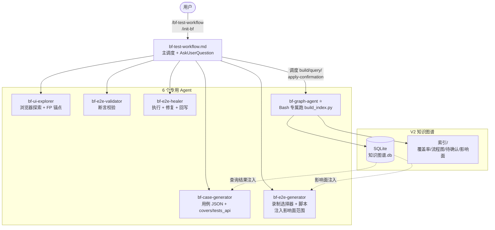
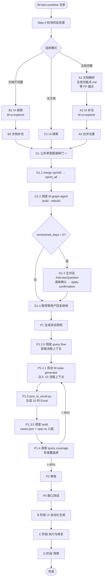
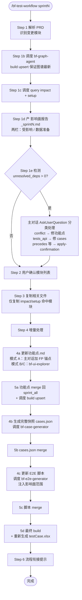
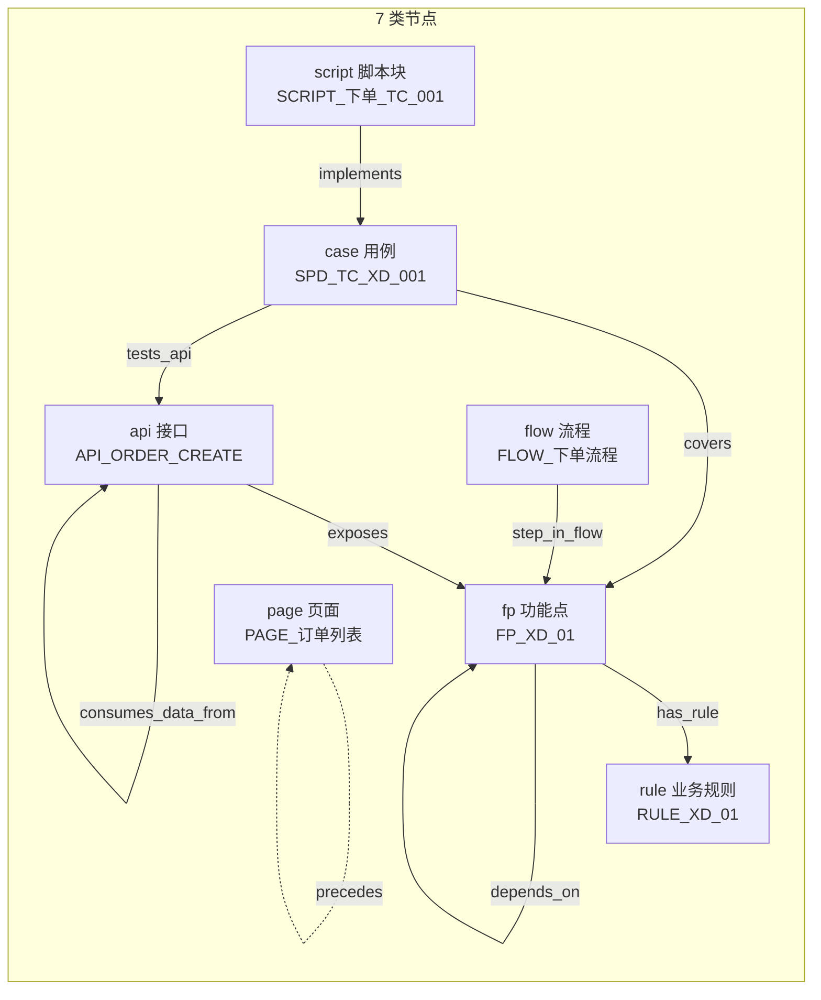
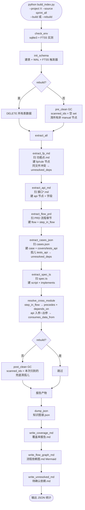
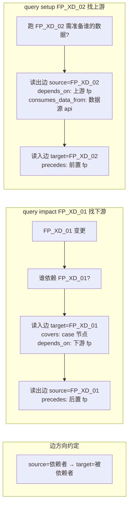
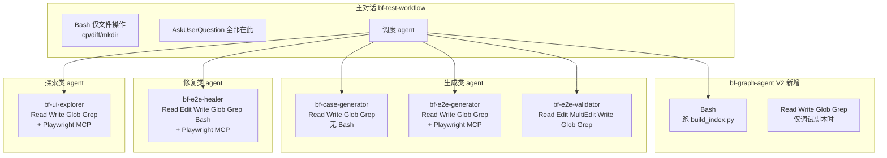
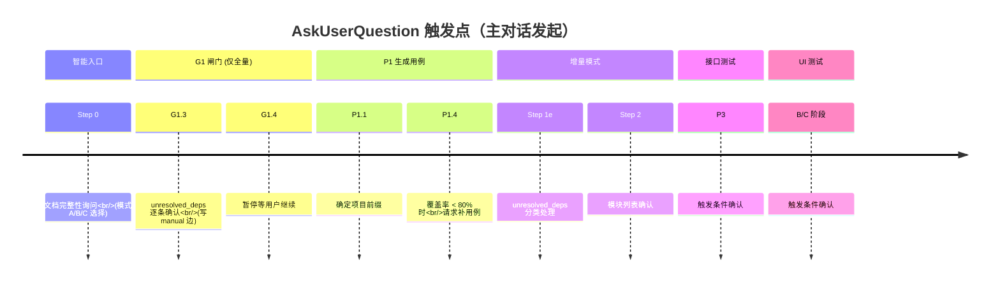

# BF-Skill V2 流程图（Mermaid 源码）

> 配套 `BF-Skill-V2-流程图.drawio`（V1 二进制版）。Mermaid 版可在 GitHub/IDE 直接渲染，便于版本管理与编辑。

## 1. 整体架构

## 2. 全量模式工作流（sprint0）

## 3. 增量模式工作流（sprintN）

## 4. 知识图谱节点类型与边

## 5. build_index.py 内部流程（含两阶段 GC）

## 6. 影响面查询语义（impact / setup）

## 7. agent 工具权限矩阵

## 8. AskUserQuestion 出现时机

